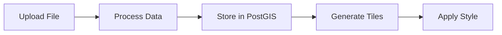

# Working with Layers

Layers are the fundamental building blocks of Cloud Native GIS. This guide covers everything you need to know about creating, managing, and serving geospatial layers.

## Layer Types

### Vector Layers

Vector layers contain geometric features (points, lines, polygons) with associated attributes.

**Supported formats:**

- Shapefile (`.shp`)
- GeoJSON (`.geojson`)
- GeoPackage (`.gpkg`)
- KML (`.kml`)
- CSV with geometry (`.csv`)

**Storage:** Vector data is stored in PostGIS and served as Mapbox Vector Tiles (MVT).

### Raster Layers

Raster layers contain gridded data such as satellite imagery, elevation models, or thematic maps.

**Supported formats:**

- GeoTIFF (`.tif`, `.tiff`)
- Cloud Optimized GeoTIFF (COG)
- PMTiles (`.pmtiles`)

## Layer Management

### Creating a Layer



1. Navigate to **Admin > Cloud Native GIS > Layers**
2. Click **Add Layer**
3. Fill in the required fields:
   - **Name**: Unique identifier for the layer
   - **Title**: Display name
   - **Description**: Layer description
   - **File**: Your geospatial data file

### Layer Properties

| Property | Description |
|----------|-------------|
| `name` | Unique layer identifier |
| `title` | Human-readable display name |
| `description` | Layer description |
| `created_at` | Creation timestamp |
| `updated_at` | Last modification timestamp |
| `bbox` | Bounding box (auto-calculated) |
| `srid` | Spatial Reference ID |

### Updating a Layer

To update layer data:

1. Go to the layer in admin
2. Upload a new file
3. The old data will be replaced

!!! warning
    Updating a layer replaces all existing features. Consider creating a new layer version instead.

### Deleting a Layer

1. Select the layer(s) in the admin list
2. Choose "Delete selected layers" from the action dropdown
3. Confirm deletion

!!! danger
    Layer deletion is permanent and cannot be undone.

## Tile Serving

### Vector Tiles (MVT)

Vector layers are served as Mapbox Vector Tiles:

```
/api/v1/layer/{layer_id}/tile/{z}/{x}/{y}.mvt
```

### Raster Tiles

Raster layers support multiple formats:

```
# PNG tiles
/api/v1/layer/{layer_id}/tile/{z}/{x}/{y}.png

# JPEG tiles
/api/v1/layer/{layer_id}/tile/{z}/{x}/{y}.jpg
```

### PMTiles

For PMTiles layers, use the direct PMTile endpoint:

```
/api/v1/pmtile/{layer_id}/{path}
```

## Layer Attributes

### Viewing Attributes

Each vector layer has associated attributes that can be:

- Viewed in the admin interface
- Queried via the API
- Used for styling rules

### Attribute Types

| Type | Description |
|------|-------------|
| `string` | Text values |
| `integer` | Whole numbers |
| `float` | Decimal numbers |
| `boolean` | True/False values |
| `date` | Date values |
| `datetime` | Date and time values |

## Best Practices

1. **Use descriptive names**: Choose clear, meaningful layer names
2. **Optimize data**: Simplify geometries for web display
3. **Set appropriate zoom levels**: Configure min/max zoom for performance
4. **Apply styles**: Create styles to enhance visualization
5. **Document layers**: Add descriptions and metadata

---

Made with :heart: by [Kartoza](https://kartoza.com) | [Donate!](https://github.com/sponsors/kartoza) | [GitHub](https://github.com/kartoza/CloudNativeGIS)
